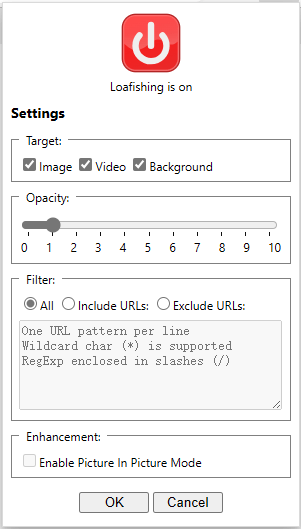

# Loafishing 浏览器摸鱼扩展
让网页中的图片、视频和背景图透明化，当鼠标移上去后恢复显示。适用于 Google Chrome, Microsoft Edge, Opera 等 Chromium 内核的桌面浏览器。本浏览器扩展旨在让您在工作时安全地浏览 NSFW 的内容。

## 安装方法

打开浏览器的”**管理扩展程序**“页面，开启”**开发人员模式**“，点击”**加载已解压的扩展程序**“按钮，选择安装本项目下的 *loafishing* 文件夹。

